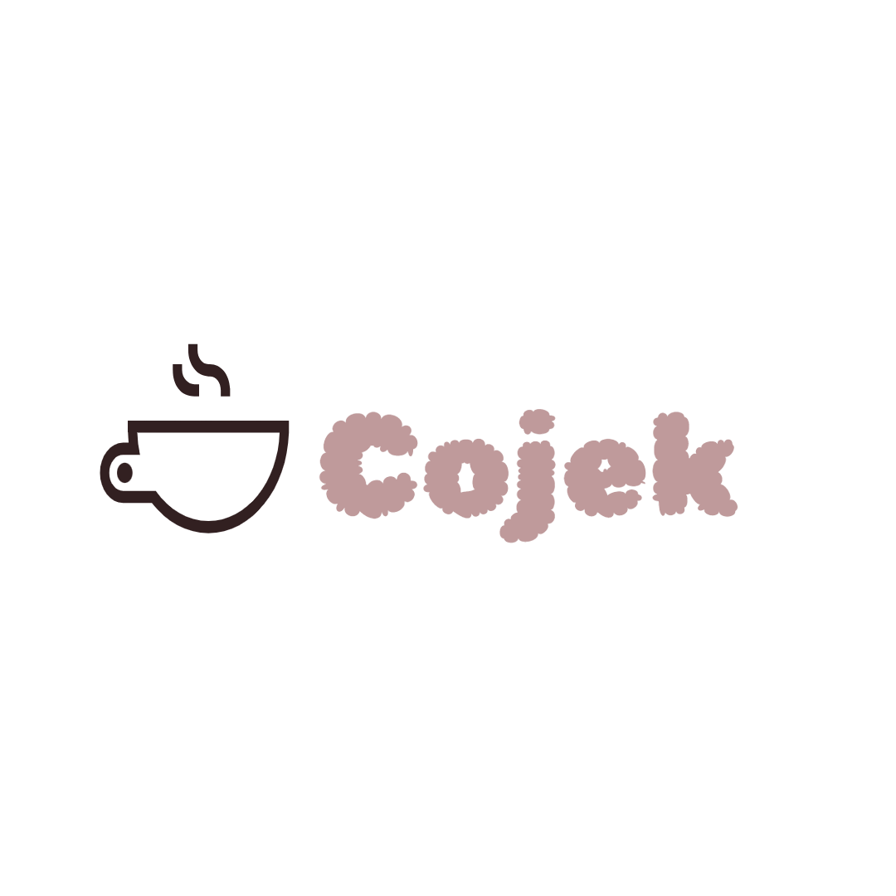

# Cojek – AI-Powered Collaborative Project Platform

## Acknowledgments & Hackathon

This project was created as part of the **CS Girllies Hackathon** —
an empowering event bringing together developers, designers, and innovators to build meaningful projects and learn together.

**Special thanks to the CS Girllies Discord Community** for organizing this hackathon and providing an encouraging, inclusive space for collaboration and creativity.

---

##  Hackathon Project Note

_Cojek is built specifically for the CS Girllies hackathon, showing how AI can enhance project ideation, teamwork, and learning for all skill levels. The features were crafted with rapid prototyping and collaborative growth in mind._

---

## Overview
Cojek is a web platform that helps users discover, plan, and complete software projects collaboratively or solo.

---

## Functionalities & Features

**Cojek** bundles these main features:

### 1. **AI Project Idea Generation**
Type your skills or interests and receive tailored project ideas powered by state-of-the-art AI (Hugging Face Mistral-7B).

### 2. **Project Details & Requirements**
Select a suggestion and instantly get a full description, goals, recommended tech stack, and functionality outline.

### 3. **Roadmap Generator**
Each confirmed project can have an AI-generated step-by-step roadmap, breaking down work into manageable tasks/milestones.

### 4. **AI Tutor/Advisor**
Chat with an AI assistant at any stage for guidance, debugging help, or brainstorming — just like messaging a real mentor!

### 5. **Team Creation & Management**
Create or join teams, invite others, and organize group work on shared projects.

### 6. **Messaging**
Built-in team chat/messaging feature for easy communication and coordination.

### 7. **Progress Tracking**
Log individual or group progress through the project, keep up motivation, and visualize achievements.

### 8. **Activity Logs & Notifications**
See a summary of recent actions, get notified of team updates or project progress, and stay in the loop.

### 9. **Robust Database & API**
Structured data model for users, teams, messages, and projects. APIs are documented, modular, and ready for full-stack apps.

---

## Tech Stack

- **Backend:** PHP (REST APIs), MySQL
- **Frontend:** React (suggested for UI/chat flows)
- **AI:** Hugging Face Inference API (Mistral-7B model)
- **Auth:** Session/token-based (can upgrade to JWT)

---

## Setup Instructions

1. **Clone this repo**
2. **Install PHP 8.x, MySQL/MariaDB** (and `curl` for PHP)
3. **Create the database**
   - Import `Cojek.sql`
4. **Configure backend**
   - Set your API key in `/backend/config/api_keys.php`
   - Add `/backend/config/` and `.env` to `.gitignore`
5. **Run backend and DB**
   - Use: Apache + php-fpm or local dev server

---

## Entity/Association Diagram

---

## Database Tables

- `users`
- `projects`
- `teams`
- `team_members`
- `messages`
- `notifications`
- `progress`
- `roadmaps`
- `activity_log`
---

## Security & Scaling Notes

- API keys go in `/backend/config/api_keys.php` (never commit)
- Add token-based auth for production (JWT/session)
- For public apps, use HTTPS and validate input

---

## Credits / Attribution

This project uses the **React + Vite** starter template from [vitejs/vite](https://github.com/vitejs/vite) (see [original repo](https://github.com/vitejs/vite/tree/main/packages/create-react-app)).

Certain ESLint, Babel, and SWC plugin configurations are directly sourced from Vite's official setup.

